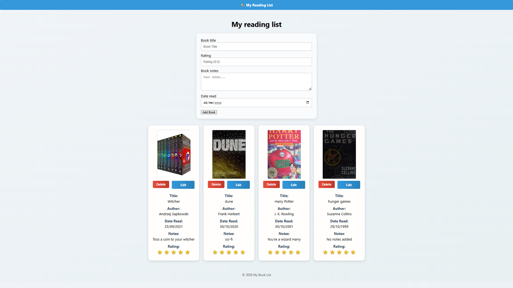
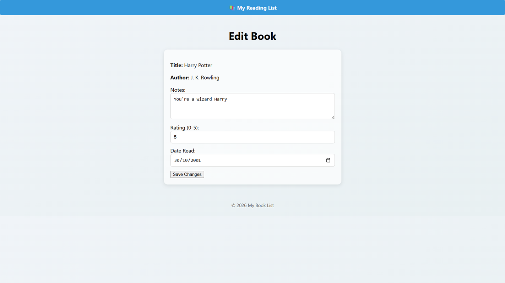

# Book Tracker

A full-stack book tracking application built with **Node.js, Express, PostgreSQL, EJS, and the OpenLibrary API**.

Book Tracker allows users to create and manage a personal reading list. When adding a book, the application automatically retrieves the author and cover image from the OpenLibrary API and stores the information in a PostgreSQL database.

## Features

* Add books to a personal reading list
* Automatically fetch book authors and cover images
* Store book data in PostgreSQL
* View all saved books
* Edit book notes, ratings, and reading dates
* Delete books from the reading list
* Responsive web interface
* Server-side rendering with EJS templates
* Full CRUD functionality (Create, Read, Update, Delete)

## Screenshots

### Homepage



### Edit Book Page



## Tech Stack

### Backend

* Node.js
* Express.js
* PostgreSQL
* pg (node-postgres)
* Axios
* dotenv

### Frontend

* EJS templates
* HTML5
* CSS3

### API Integration

* OpenLibrary API – used to retrieve book information and cover images

## Database

The application uses a PostgreSQL database.

**Database:**

```text
booklist
```

**Main table:**

```text
books
```

**Table fields:**

```text
id
title
author
rating
notes
date_read
cover_url
```

## Installation

Clone the repository:

```bash
git clone https://github.com/zireael06/book-tracker.git
```

Navigate into the project folder:

```bash
cd book-tracker
```

Install dependencies:

```bash
npm install
```

## Environment Variables

Create a `.env` file in the project root with the following variables:

```env
DB_USER=postgres
DB_HOST=localhost
DB_NAME=booklist
DB_PASSWORD=your_password
DB_PORT=5432
```

Replace `your_password` with your PostgreSQL password.

## Running the Application

Start the server:

```bash
npm start
```

For development with automatic restarting:

```bash
npm run dev
```

The application will run at:

```text
http://localhost:3000
```

## Project Structure

```text
book-tracker
│
├── public
│   ├── assets
│   │   └── default-cover.jpg
│   └── styles
│       └── main.css
│
├── screenshots
│   ├── homepage.png
│   └── edit-book.png
│
├── views
│   ├── partials
│   │   ├── header.ejs
│   │   └── footer.ejs
│   ├── edit.ejs
│   └── index.ejs
│
├── .gitignore
├── package-lock.json
├── package.json
└── server.js
```

## Future Improvements

* User authentication and user accounts
* Search and filter books
* Reading progress tracking
* Book categories and genres
* Cloud deployment
* Improved mobile responsiveness

## Author

**Tim Baker**

Built as a full-stack development project to practise working with:

* REST APIs
* Server-side rendering with EJS
* PostgreSQL databases
* CRUD operations
* Environment variable configuration
